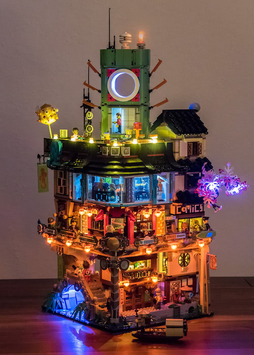
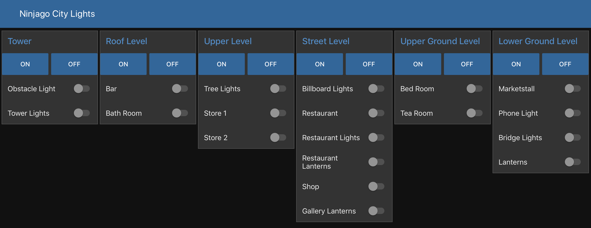
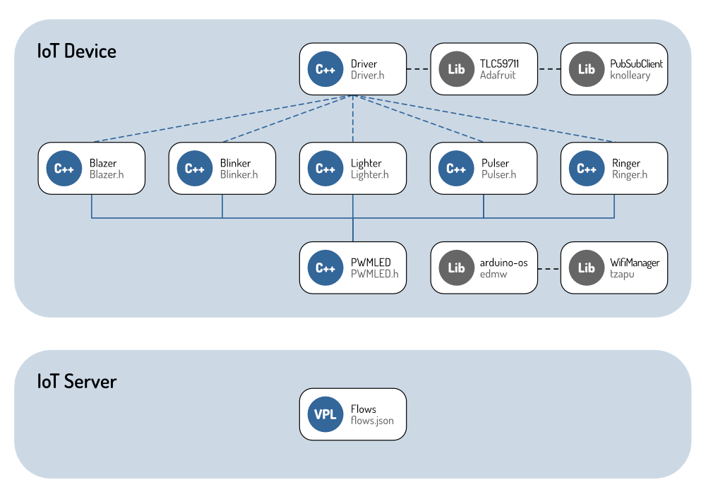
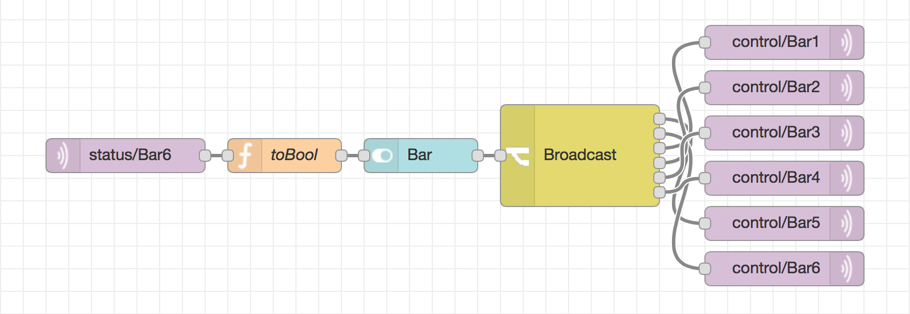
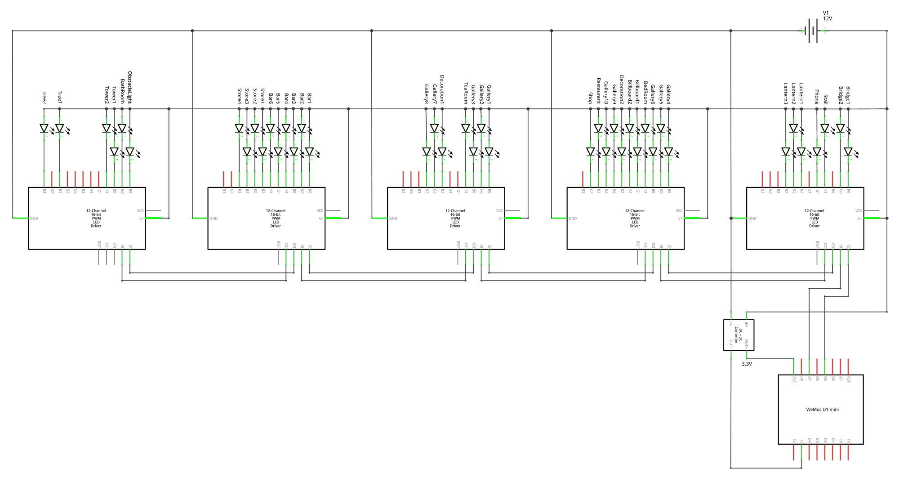

# Ninjago City Lights

[Ninjago City 70620](https://shop.lego.com/product/NINJAGO-City-70620) is a great LEGO® set. While the building already looks fantastic in day-light I was thinking of adding some lights for nighttime. The model itself has a lot of lamps and lanterns, so there are plenty of spots to put some lights into. At some places I changed the construction to include additional lamps.

This document describes how I built the electronics and software to light up the model. It does not document the installation process.

## System Architecture

The Ninjago City Lights system consists of an **IoT Device** which is driving the actual lights and communicates with an **IoT Server** which is controlling the state of the lights and provides a user interface to change that state.

[System Architecture SVG](Files/SystemArchitecture.svg)

### IoT Device

The **IoT Device** responsible for driving the lights and communicating with the controlling server is build upon a low-cost microcontroller with included wifi functionality.

The lights are miniature light-emitting diodes of various colors. The lights are driven by five led drivers with constant-current output.

The microcontoller uses the serial peripheral interface to communicate with the led drivers.

The device is connected to our home network via wifi.

### IoT Server: Message Broker

The **IoT Message Broker** runs on a server at our home and allows clients to publish and subscribe on message topics to send and receive messages.

The **IoT Device** publishes the activation state of lights to the topics `status/*` and subscribes to the topics `control/*` listening for activation commands.

The **IoT Flow Engine** subscribes to the topics `status/*` to listen for activation state changes and publishes activation commands to the topics `control/*`.

***Practical:***

When the restaurant light is being turned on the message `true` will be published to `status/restaurant` and if a client wants to turn off the tree lights, it publishes `false` to `control/tree1` and `false` to `control/tree2`.

### IoT Server: Flow Engine

The **IoT Flow Engine** runs on a server at our home and allows the visual programming of the **IoT Device**. The main purpose of the flows is to connect a user interface button with a group of lights for activation and deactivation.

Of course, there are more complicated flows possible, some ideas:

 * Turning on lights on dawn and turning them off again at sunrise.
 * Light the store in the evening, then switch to low light at closing time, then turning the store lights off at midnight.
 * ...

#### Retained Activation Commands ####

All commands published by the **IoT Flow Engine** to the control topics will have the *retained* flag set. The **IoT Message Broker** stores the latest retained message for each control topic. When the **IoT Device** subscribes to a control topic it will receive the retained message immediately after it subscribes.

This allows the **IoT Device** to restore the full activation state of all lights after startup.

### IoT Server: Dashboard

The **IoT Dashboard** is automatically generated from the buttons used in the flows and looks like this:

The dashboard can be used with any device providing a modern web browser to toggle the activation state of a light.

## Software Architecture

The Ninjago City Lights software consists of a firmware for the **IoT device** and control flows for the **IoT server**.

[Software Architecture SVG](Files/SoftwareArchitecture.svg)

### Firmware

The firmware is build of different led controlling classes to simulate various effects:

 * `Blazer`:
   a flickering flame lantern.
 * `Blinker`:
   a blinking light with configurable period and duty cycles.
 * `Lighter`:
   a steady light with adjustable brightness.
 * `Pulser`:
   a pulsating light with settable period.
 * `Ringer`:
   a phone call indicator light.

All of these effect classes inherit from the base class `PWMLED` which provides the base functionality to control, activate and deactivate a led.

The main `Driver` class ...
 * initializes all lights with their respective effect.
  * controls the led drivers via SPI.
 * connects to the wireless network.
 * communicates with the server.
  * sends the state of the lights.
  * receives commands for activation and deactivation of the lights.
 * handles activation and deactivation of the lights.

### Flows

A control flow for activating and deactivating a light is constructed of two parts connected to a switch button:

 1. **Input**

 A MQTT message receiver node listens on a lights’ status channel for a MQTT status message, transforms it into a boolean value and changes the state of the switch button accordingly.

 2. **Output**

 If a user interaction changes the state of a switch button the new boolean value will be transformed to a MQTT command message and distributed to the lights’ command channels via MQTT message sender nodes.

***Practical:***

The button `Bar` broadcasts its state `true` or `false` to any of the six bar lights. The state of the button will be derived from the activation state of the sixth (last) bar light (making the assumption that every other bar light will have the same activation state eventually).

## IoT Device

### Schematics

[Device Schematics SVG](Files/DeviceSchematics.svg)

#### Power

The **IoT Device** is powered by a 12&nbsp;V/1500&nbsp;mA power supply. While the led driver boards and thus the leds are connected to 12&nbsp;V directly, a DC-to-DC power converter is used to step down to 3.3&nbsp;V for powering the microcontroller.

#### LED Current

The led driver boards are driving each output with 15&nbsp;mA constant-current by default. This is changed to 20&nbsp;mA by soldering a 10&nbsp;kΩ resistor to each board.

### Parts

 * WeMos D1 mini – ESP-8266EX wifi board with 4MB flash (1)
 * Adafruit TLC59711 – TLC59711 driver board with 12-channels (5)
  * 10&nbsp;kΩ resistor (5)
 * Micro LEDs in various colors (white, warm white, blue, purple) (41)
 * DC-to-DC step-down converter to 3.3&nbsp;V (1)

## Glossary

<dl>
  <dt>IoT</dt>
  <dd>Internet of things – a system of interrelated computing devices.</dd>
  <dt>MQTT</dt>
  <dd>Message Queuing Telemetry Transport – publish-subscribe-based messaging protocol for IoT.</dd>
  <dt>SPI</dt>
  <dd>Serial Peripheral Interface – a synchronous serial communication interface  used for short distance communication in embedded systems.</dd>
</dl>

## Licenses

### Software components

 * Self – MIT
 * Adafruit TLC59711 – BSD
 * WifiManager – MIT
 * PubSubClient – MIT

### Server components

 * moquitto – EPL
 * node-red – Apache
